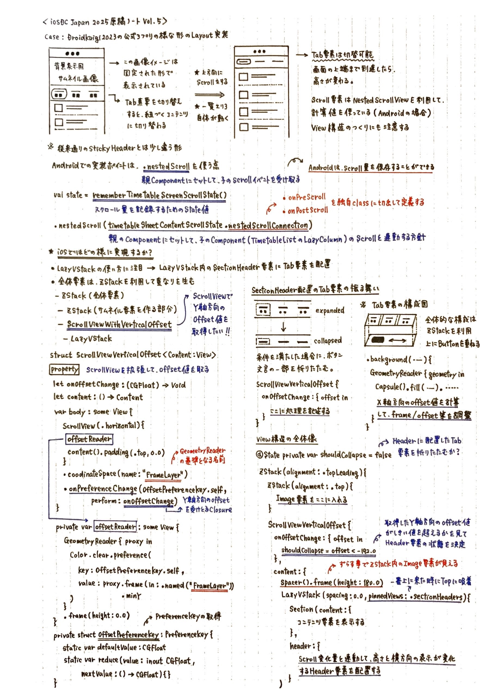

# 見た目に惑わされないUI設計と実装の勘どころ
## 〜SwiftUI・UIKitで読み解く複雑度の見極め方〜

## はじめに

一見シンプルに見えるUIでも、実装してみると意外と時間がかかる──そんな経験は誰にでもあるはずです。「これくらいなら簡単ですよね？」と言われて引き受けたものの、蓋を開けてみると複雑なロジックやパフォーマンス調整に追われることになった話は、開発現場では日常茶飯事です。

特に、Figma等をはじめとするプロトタイプツールで作られた美しいアニメーションやインタラクションを見て、「これなら1日で実装できそう」と見積もったものの、実際は1週間かかってしまった経験は多くのエンジニアが持っているでしょう。この問題の根本原因は、デザインツールでは簡単に実現できる表現が、実際のプログラミングでは複数の技術的制約や考慮事項を抱えていることにあります。

画面遷移のアニメーション一つとっても、メモリ効率、バッテリー消費、デバイス性能の差、OS版の互換性など、見た目からは想像できない複雑な要素が絡み合います。本稿では、SwiftUI・UIKit・Androidでの実装経験から得た知見をもとに、デザイン仕様から実装難易度を読み解くための視点と判断基準を紹介します。

## はじめに 

一見シンプルに見えるUIでも、実装してみると意外と時間がかかる──そんな経験は誰にでもあるはずです。「これくらいなら簡単ですよね？」と言われて引き受けたものの、蓋を開けてみると複雑なロジックやパフォーマンス調整に追われることになった話は、開発現場では日常茶飯事です。

特に、Figma等をはじめとするプロトタイプツールで作られた美しいアニメーションやインタラクションを見て、「これなら1日で実装できそう」と見積もったものの、実際は1週間かかってしまった経験は多くのエンジニアが持っているでしょう。この問題の根本原因は、デザインツールでは簡単に実現できる表現が、実際のプログラミングでは複数の技術的制約や考慮事項を抱えていることにあります。

画面遷移のアニメーション一つとっても、メモリ効率、バッテリー消費、デバイス性能の差、OS版の互換性など、見た目からは想像できない複雑な要素が絡み合います。本稿では、SwiftUI・UIKit・Androidでの実装経験から得た知見をもとに、デザイン仕様から実装難易度を読み解くための視点と判断基準を紹介します。

## 本稿で紹介する事例と難易度を見極めるポイント概要

モバイルアプリ開発において、見た目のシンプルさと実装の複雑さは必ずしも一致しません。以下、主要な実装パターンの分析と、それぞれの難易度判定基準、さらにはパフォーマンス考慮事項とプロジェクト計画への活用方法を総合的に解説します。

例えば、高さが自動調整されるTextViewでは、UIViewRepresentableを使用したUIKit連携が必要で、テキスト変更に応じたビューサイズ更新、キーボード制御、フォーカス状態管理など複数の状態同期や動作変更対応等、見た目以上の複雑性があります。固定ヘッダー機能は、iOSではGeometryReaderによるスクロール位置監視とヘッダー位置の動的調整が必要で、特にリスト表示との組み合わせではセル再利用効率等の調整が課題となります。DragGestureによるカードスワイプは、座標変更、判定ロジック、回転角度計算など多要素の同時制御が必要で、「自然な動き」実現には細かな調整がを要します。動的タグ表示はForEachの二重ループとGeometryReaderでの動的配置が必要で、リアルタイム操作時はレイアウト再計算と位置調整の同期が求められ、Timer処理カルーセルは0.01秒間隔Timer、UIScrollView制御、スクロール状態監視など高度技術の組み合わせが必要になります。

※次ページ以降に実際の事例を示した詳細なノートを掲載していますので、是非参考にしてみて下さい🗒️

## まとめ

「シンプルに見える」UIの背後には、往々にして複雑な実装が隠れています。重要なのは、見た目の印象に惑わされることなく、技術的な観点から冷静に実装難易度を評価することです。Timer処理、GeometryReader、カスタムジェスチャー、状態管理といった要素の組み合わせを適切に見極めることで、プロジェクトの成功確率を大幅に向上させることができるでしょう。さらに、アクセシビリティ、多言語対応、デバイス固有の問題、ストア審査基準など、機能実装以外の要求事項も実装難易度に大きく影響します。これらの「見えない要件」を事前に洗い出し、適切に工数見積もりに反映させることが、プロジェクト成功の鍵となります。日々のUI実装における小さな判断の積み重ねが、最終的な開発効率とアプリケーションの品質を決定します。本稿で紹介した視点と判断基準を活用し、デザイナーとエンジニアの認識ギャップを最小化し、より効果的なモバイルアプリ開発を実現していただければと思います。技術の進歩とともに実装方法も変化していくため、継続的な学習と知見の更新も欠かせません。チーム内での知見共有と、定期的な技術検証により、常に最適な実装判断ができる体制を整えることが、長期的な開発効率の向上につながります。エンジニアとデザイナーが協力し、技術的制約を理解した上でのUI設計を行うことで、真にユーザーにとって価値のあるアプリケーションを創り出すことができるでしょう。

### 【図解解説ノートVol.1🗒️】

### 【図解解説ノートVol.2🗒️】

### 【図解解説ノートVol.3🗒️】

### 【図解解説ノートVol.4🗒️】

### 【図解解説ノートVol.5🗒️】

### 【図解解説ノートVol.6🗒️】

### 【図解解説ノートVol.7🗒️】

