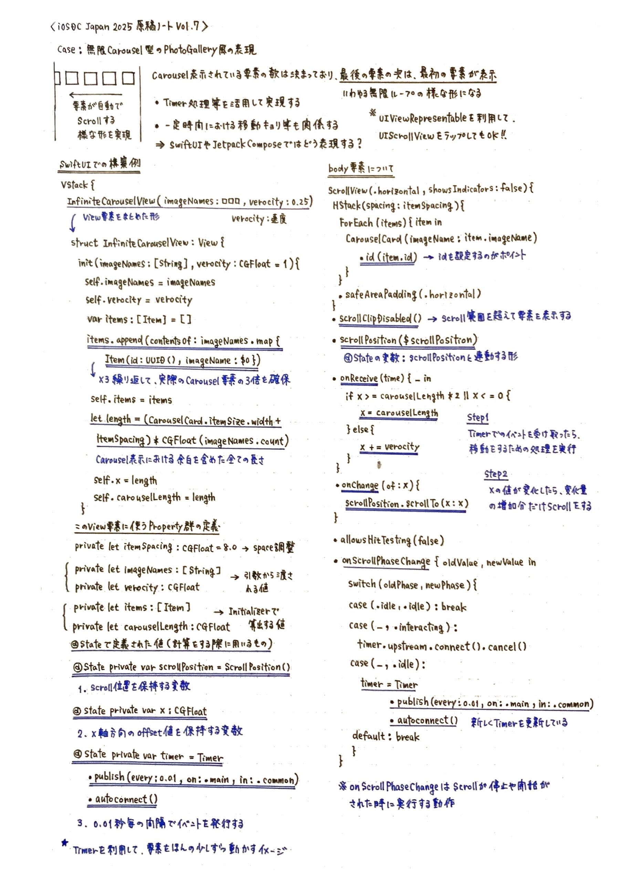

# 見た目に惑わされないUI設計と実装の勘どころ
## 〜SwiftUI・UIKitで読み解く複雑度の見極め方〜

## はじめに

一見シンプルに見えるUIでも、実装してみると意外と時間がかかる──そんな経験は誰にでもあるはずです。「これくらいなら簡単ですよね？」と言われて引き受けたものの、蓋を開けてみると複雑なロジックやパフォーマンス調整に追われることになった、という話は開発現場では日常茶飯事です。

本稿では、SwiftUI・UIKit・Androidでの実装経験や考察から得た知見をもとに、デザイン仕様から実装難易度を読み解くための視点や判断基準を、添付画像の具体的なコード例を交えながら解説します。日々のUI実装における小さな判断を支える技術的な視点を、実例とともにお届けします。

## 1. シンプルな見た目に潜む複雑性の罠

### 1.1 カルーセル・PhotoGalleryの落とし穴

添付画像のCase 1では、`InfiniteCarouselView`の実装例が示されています。一見するとただの横スクロールリストに見えますが、実際のコードを見ると：

```swift
struct InfiniteCarouselView: View {
    @State private var items: [Item] = []
    @State private var x: CGFloat = 0
    @State private var timer = Timer.publish(every: 0.01, on: .main, in: .common)
    
    var body: some View {
        ScrollView(.horizontal, showsIndicators: false) {
            // 複雑な座標計算とタイマー処理
        }
    }
}
```

**隠れた複雑性**：
- 無限スクロール実現のためのアイテム重複管理
- `Timer`による定期更新処理（0.01秒間隔）
- `GeometryReader`を使った動的なサイズ計算
- スクロール位置の手動制御とオフセット調整

このような実装では、メモリリークやパフォーマンス劣化のリスクが高く、デバッグも困難になります。

### 1.2 スクロール処理の見極めポイント

添付画像のCase 2では、StickyHeaderとNestedScrollの実装パターンが解説されています。Android開発者には馴染み深い`CoordinatorLayout`と`NestedScrollView`の組み合わせですが、iOSでの実装では以下の課題があります：

**判断基準**：
- 単純な縦スクロール → 標準の`ScrollView`で対応可能（低難易度）
- StickyHeader付きスクロール → カスタム実装が必要（中難易度）
- 複数スクロール領域の連携 → 高度な座標計算が必要（高難易度）

## 2. テキスト入力UIの複雑度判定

### 2.1 ResizingTextViewの実装考察

添付画像のCase 3では、動的にサイズが変わるテキストビューの実装が示されています。

```swift
struct ResizingTextView: View {
    @State var sampleText = ""
    @Binding var text: String
    
    var body: some View {
        // UITextViewRepresentableを利用した実装
    }
}
```

**見極めポイント**：
- 単純なTextField → SwiftUIの標準コンポーネントで対応（低難易度）
- 高さ自動調整 → `UIViewRepresentable`でUIKit連携が必要（中難易度）
- リッチテキスト対応 → カスタムレンダリングが必要（高難易度）

### 2.2 キーボード制御の隠れた複雑性

画像に示されているキーボード制御の例では：

```swift
func hideKeyboard() {
    let resign = #selector(UIResponder.resignFirstResponder)
    UIApplication.shared.sendAction(resign, to: nil, from: nil, for: nil)
}
```

このような実装が必要になるケースでは、iOS特有のキーボード管理の複雑性を理解しておく必要があります。

## 3. ジェスチャー・インタラクションの実装判定

### 3.1 Swipe・Drag操作の複雑度階層

添付画像のCase 4では、Tinder風のSwipe UIの実装が詳細に解説されています。

```swift
struct SwipableCardView {
    @State private var swipeStatus: SwipeStatus = .none
    @State private var swipeOffset: CGSize = .zero
    
    var body: some View {
        // DragGestureとrotationEffectの組み合わせ
        .gesture(
            DragGesture()
                .onChanged { value in
                    swipeOffset = value.translation
                }
                .onEnded { value in
                    // 複雑な判定ロジック
                }
        )
    }
}
```

**実装難易度の段階**：
- **Level 1**: 単純なタップジェスチャー
- **Level 2**: ドラッグによる移動（画像の基本パターン）
- **Level 3**: 物理演算を伴うスワイプ判定（画像の`thresholdActionPercentage`実装）
- **Level 4**: 複数カードの連携アニメーション（画像のGeometryReaderを使った実装）

### 3.2 パフォーマンスへの影響評価

画像に示されている`removeAction`の実装では、カードの削除とリスト更新が同期的に行われています。これらの処理が重複すると、UIの応答性に影響を与える可能性があります。

## 4. リスト・コレクション表示の複雑性判定

### 4.1 NestedScrollViewの設計考慮点

添付画像のCase 5では、DroidKaigi 2023のセッション一覧のような複雑なレイアウトが示されています。

**AndroidからiOSへの移植における注意点**：
- `NestedScrollView` → SwiftUIでは`ScrollView`の入れ子実装
- `LazyVStack`のパフォーマンス特性の理解
- SectionHeaderの固定表示実装の差異

### 4.2 StickyHeaderの実装パターン

```swift
ScrollViewWithVerticalOffset {
    // GeometryReaderを使った座標取得
    GeometryReader { proxy in
        // 複雑なオフセット計算
    }
}
```

このような実装では、スクロール性能とメモリ使用量のトレードオフを慎重に検討する必要があります。

## 5. チップ・タグ表示の実装判定

### 5.1 FlowLayoutの実装アプローチ

添付画像のCase 7では、TagChipの実装例が詳細に示されています。

```swift
// iOS (SwiftUI)での実装例
ForEach(chips.indices, id: \.self) { index in
    ForEach(chips[index].indices, id: \.self) { chipIndex in
        Text(chips[index][chipIndex].chipText)
            .modifier(...)
    }
}
```

**判断基準**：
- 固定レイアウト → 標準的なHStack/VStackで対応（低難易度）
- 動的折り返し → カスタムFlowLayout実装が必要（中〜高難易度）
- リアルタイム追加/削除 → 状態管理とアニメーションの複雑化（高難易度）

### 5.2 GeometryReaderの適切な使用判断

画像に示されているように、動的なレイアウト計算では`GeometryReader`の使用が避けられませんが、これによる再描画コストを考慮する必要があります。

## 6. 実装難易度判定の実践的チェックリスト

### 6.1 技術的複雑性の段階評価

**低難易度（1-3日）**：
- 標準UIコンポーネントで実現可能
- 単純な状態管理（@State程度）
- 基本的なアニメーション

**中難易度（1-2週間）**：
- カスタムコンポーネントの組み合わせ
- UIKit連携（UIViewRepresentable）
- 複雑なジェスチャー処理

**高難易度（2週間以上）**：
- 完全カスタム描画
- 複雑な物理演算
- プラットフォーム固有API直接操作

### 6.2 パフォーマンス影響度の評価

添付画像の各ケースから読み取れる共通パターン：

1. **Timer使用の頻度** - 高頻度更新は要注意
2. **GeometryReaderの使用範囲** - 過度な使用は性能劣化
3. **状態変更の波及範囲** - 大きな状態ツリーの更新は重い

## 7. プロジェクト計画への活用

### 7.1 見積もり精度の向上

デザイン仕様書を受け取った際の確認ポイント：

1. **隠れた状態管理の洗い出し**
2. **アニメーション仕様の詳細確認**
3. **エッジケースの動作定義**
4. **パフォーマンス要件の明確化**

### 7.2 実装方針の決定フロー

```
デザイン仕様 → 技術的複雑性評価 → リスク分析 → 実装アプローチ選択
```

各段階での判断材料として、本稿で示した実例パターンを活用することで、より正確な見積もりと効果的な実装戦略の立案が可能になります。

## まとめ

「シンプルに見える」UIの背後には、往々にして複雑な実装が隠れています。添付画像で示された具体的なコード例からも分かるように、ユーザーが目にする最終的なUIと、それを実現するためのコードの複雑さには大きなギャップがあります。

重要なのは、見た目の印象に惑わされることなく、技術的な観点から冷静に実装難易度を評価することです。Timer処理、GeometryReader、カスタムジェスチャー、状態管理といった要素の組み合わせを適切に見極めることで、プロジェクトの成功確率を大幅に向上させることができるでしょう。

日々のUI実装における小さな判断の積み重ねが、最終的な開発効率とアプリケーションの品質を決定します。本稿で紹介した視点と判断基準を活用し、より効果的なモバイルアプリ開発を実現していただければと思います。

## 【図解解説ノートVol.1🗒️】


## 【図解解説ノートVol.2🗒️】


## 【図解解説ノートVol.3🗒️】


## 【図解解説ノートVol.4🗒️】


## 【図解解説ノートVol.5🗒️】


## 【図解解説ノートVol.6🗒️】


## 【図解解説ノートVol.7🗒️】


